<p align="center">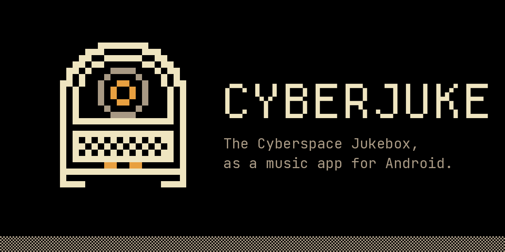</p>

<p align="center">
  <a href="https://github.com/IamAndelib/CyberJuke/releases/latest"></a>
  <a href="LICENSE"></a>
  <a href="https://github.com/IamAndelib/CyberJuke/actions/workflows/ci.yml"></a>
  
</p>

# CyberJuke

**The [Cyberspace](https://beta.cyberspace.online) Jukebox as a music-streaming app for Android.**

The Cyberspace Jukebox is where people on Cyberspace share the music they love, posted alongside what they write. It's a great way to find music you'd never have come across. CyberJuke turns it into a proper music app. It keeps Cyberspace's retro look and adds a music app's playback: a mini player, a Now Playing screen, an Up Next queue, autoplay of similar songs, and playback that continues with the screen off.

> **Unofficial.** CyberJuke is a fan-made app. It is not made, endorsed or supported by Cyberspace or its creator.

**[Download the latest APK](https://github.com/IamAndelib/CyberJuke/releases/latest)** · Android 7.0 or newer · free and open source (GPL-3.0)

## Highlights

| | | |
|:-:|:-:|:-:|
| 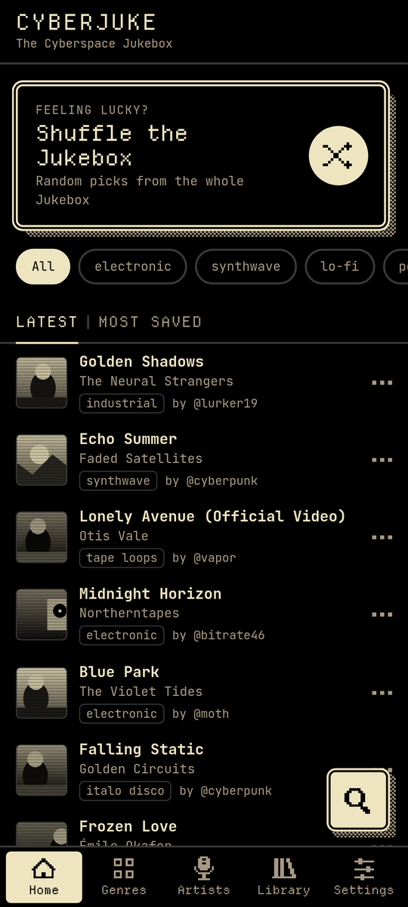<br>**Home**: the latest Jukebox posts, genre filters and Shuffle | 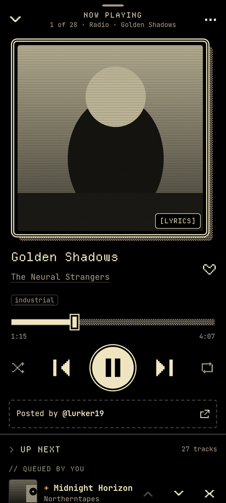<br>**Now Playing**: big artwork, seek, shuffle, repeat, like | 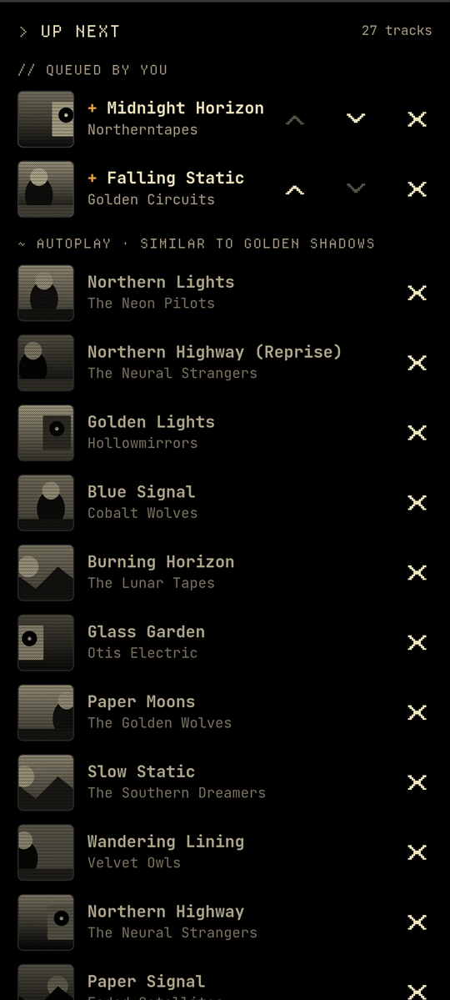<br>**Up next**: your queue first, then autoplay of similar songs |
| 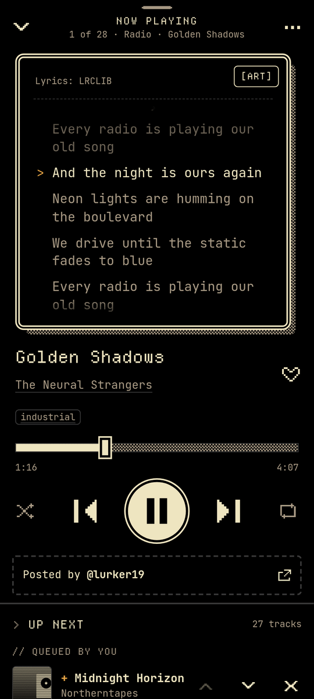<br>**Synced lyrics**: tap the artwork, in any language | 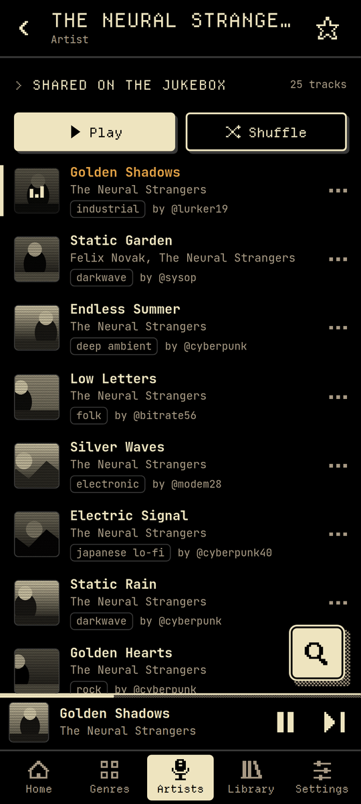<br>**Artist pages**: what people shared, then the discography | 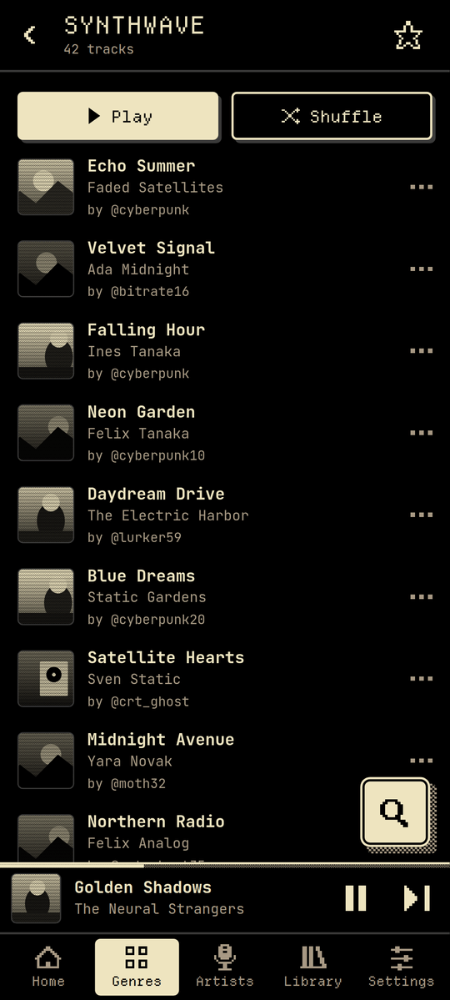<br>**Genres**: every genre, with Play and Shuffle |
| 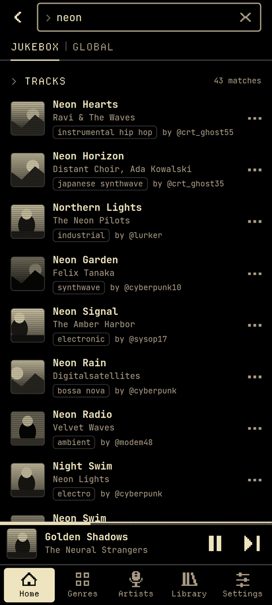<br>**Search**: the whole Jukebox, typo-tolerant, or Global | 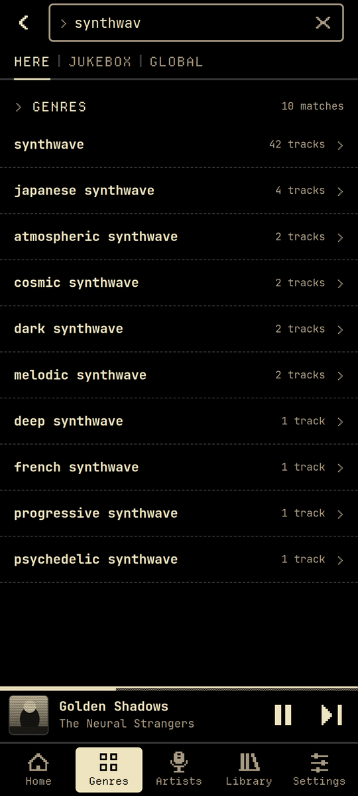<br>**Here**: search just the page you're on | 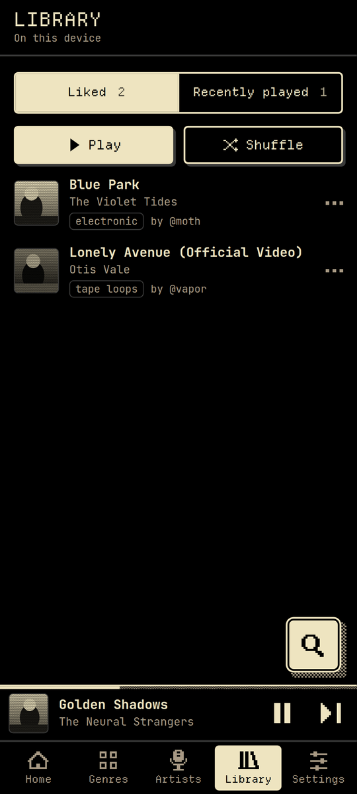<br>**Library**: liked tracks and recently played |

## Features

- **Latest tracks** posted to the Jukebox, as an endless list, with a "new tracks" button when something new is posted.
- **Most saved**: the tracks people saved most on Cyberspace, this month or all time.
- **Shuffle the Jukebox**: one tap for a random mix from the whole Jukebox.
- **Autoplay**: when a list ends, similar songs keep playing. A Jukebox song leads to Jukebox songs picked by artist, genre and what the same people share; a Global song leads to that song's radio. Tracks you add with "Add to queue" always stay next.
- **Search** every track on the Jukebox by title, artist or genre, with typo tolerance and recent searches. **Here** searches only the page you're on: a genre, an artist, an album, your library, or the Genres and Artists lists themselves.
- **Genres** and **Artists**: browse everything shared on the Jukebox, A–Z or by popularity, and ★ your favourites to pin them to the top. An artist page puts what Cyberspace people shared first, then the artist's top songs, albums, live albums, EPs and singles from the artist's own page.
- **Global search** (optional): a separate Global mode for any song, album or artist beyond the Jukebox. Global tracks play, like and queue like any other, but never show up on Home, Genres, Most saved or Shuffle.
- **Sign in with Cyberspace** (optional): the Jukebox also shows the members-only shared tracks, marked `[members]`. See [Signing in](#signing-in).
- **Library**: liked tracks and recently played, stored on your phone.
- **Background playback**: the notification, lock screen and headset buttons all work, and the queue keeps going with the screen off.
- **Now Playing**: seek, shuffle, repeat, like, synced lyrics, share, "Playing from …", and an Up Next queue you can reorder.
- **"Posted by @user"** opens the original post on Cyberspace, so you can see what the poster wrote and reply.
- **Undo** for unlike, unfavourite, removing from Up next and clearing history or recent searches.
- **NSFW** posts are hidden unless you turn them on.
- **Made for thumbs**: scroll memory everywhere, back-to-top, an A–Z fast scroller, pull to refresh, long-press for a track's menu, and swipe Now Playing down to close.

## Themes

Eight Cyberspace themes, switchable any time in Settings:

<p align="center">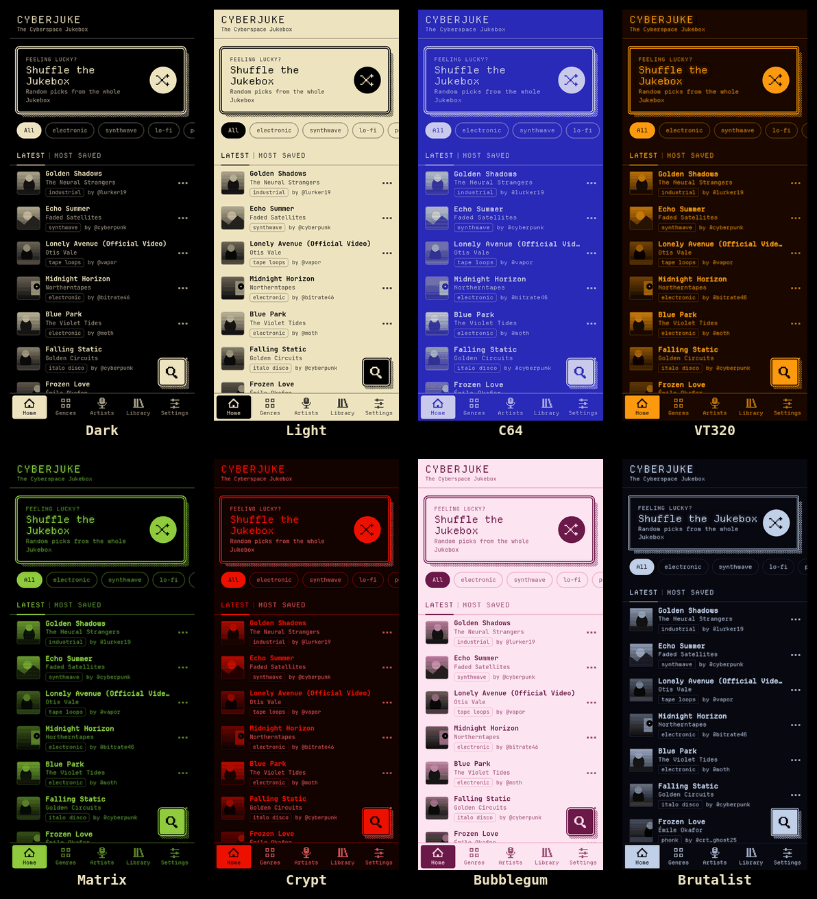</p>

## Install

1. Download the latest `CyberJuke-<version>.apk` from [Releases](../../releases).
2. Optional: verify it (see [Verifying a release APK](#verifying-a-release-apk)).
3. Open the APK on your phone and allow installing from this source when Android asks.

Requires Android 7.0 (API 24) or newer. Android 13+ asks for notification permission the first time you play something. The permission is only used for the playback controls.

CyberJuke is not on the Play Store and won't be (see [YouTube](#youtube)). It is being prepared for [F-Droid](#f-droid).

### Preview builds

The rolling [`preview`](../../releases/tag/preview) pre-release is a separate app, **CyberJuke Preview** (`io.github.iamandelib.cyberjuke.preview`), built from the latest `main`. It installs alongside CyberJuke and never shares its data: liked tracks, history, settings and sign-in are separate. It is signed with its own key, not the release key.

If you installed a preview from before October 2026 (named "CyberJuke", debug-signed), uninstall it. That build was signed with a key that was public in this repository, so if you signed in on it, change your Cyberspace password: that revokes any copied login token.

### Verifying a release APK

Each release has the APK and a `.sha256` file next to it.

```bash
sha256sum -c CyberJuke-<version>.apk.sha256
apksigner verify --print-certs CyberJuke-<version>.apk   # from the Android SDK build-tools
```

`apksigner` must report `Verified using v2 scheme (APK Signature Scheme v2): true` and the release certificate:

```
Signer #1 certificate SHA-256 digest: 1c007729638d095f68160456af0fb9799d75ba4682faf18ca520a5842bb5ce61
```

Releases are built by the `Release` workflow from a tagged commit with no caches and no install scripts, then signed in a separate job. The build is meant to be reproducible: building the tag yourself (see [Building](#building)) gives the same APK apart from the signature, which `apksigcopier compare` checks.

## How it works

| Part | What it does |
|---|---|
| **UI** | Preact and TypeScript (`src/`) in a [Capacitor](https://capacitorjs.com) WebView, in layers that only import downward: `app/` (boot, shell) → `features/` (one folder per screen) → `ui/` (shared components and hooks) → `stores/`, `player/`, `data/` → `core/` (storage, cache, errors, guards). ESLint enforces the direction. Stores (`src/stores/`) hold the catalog, library, history and settings as signals. |
| **Track list** | Reads the same public post data the Cyberspace website shows on its Jukebox page, through `src/data/firestore.ts`. All data access goes through the `TrackSource` interface in `src/data/source.ts`, so it can be swapped for the [official Cyberspace API](https://api.cyberspace.online) by changing one file. |
| **Playback** | Every Jukebox track is a YouTube link. A native Android player (`android/app/src/main/java/.../playback/`; Capacitor plugins in `bridge/`, YouTube code in `yt/`, lyrics in `lyrics/`, HTTP and back-off in `net/`) resolves the audio stream with [NewPipeExtractor](https://github.com/TeamNewPipe/NewPipeExtractor) and plays it with Media3/ExoPlayer in a media session. The queue lives in that native service, which is what keeps music going with the screen off. The web side talks to it through a Capacitor plugin (`src/player/native.ts`). |
| **Global search, artist pages** | YouTube Music data, read on the phone through the `JukeMusic` plugin (`src/data/ytmusic.ts` on the web side): the artist's own page for top songs and the discography, NewPipeExtractor for search, albums and playlists. Results are cached for 10 minutes. |
| **Lyrics** | Looked up on [LRCLIB](https://lrclib.net) when the lyrics panel is open, and cached on the phone. |
| **Sign-in** | Optional. `src/data/auth.ts` signs in with Cyberspace's own login (Firebase Auth, email and password, over plain HTTPS; no Firebase SDK). Signed in, requests carry your login token and use the same query the site uses for members. |

## Privacy and data

CyberJuke has no account of its own, no analytics, no ads and no tracking. It contains no Google Play Services or Firebase SDK.

**Stored on the phone** (in the app's private storage):

| What | Where |
|---|---|
| Liked tracks, recently played, settings, favorite genres and artists, recent searches | App data (Capacitor Preferences and app files). Android may include these in your own Google backup; members-only tracks are removed whenever the app starts signed out, so a restored backup never brings them back. |
| The cached Jukebox catalog and lyrics | App data and cache; cleared on sign-out |
| Login token, user id and @username (only if you sign in) | Encrypted with an Android Keystore key; excluded from Android cloud and device-transfer backups |
| Stream URLs, YouTube Music results | Memory only |

**Sent over the network**, all over HTTPS:

| To | What | When |
|---|---|---|
| Cyberspace's backend (Google Firestore) | Requests for Jukebox posts; your login token if signed in | Browsing the Jukebox |
| Cyberspace's login (Google Identity Toolkit / Secure Token) | Your email and password; token refreshes | Only if you sign in |
| YouTube | The video ID of the track being played or prefetched | Playback |
| YouTube Music | Your Global search query, or the artist you open; the video ID of a Global track, for its radio (also in the background while autoplay refills); the video ID of the playing track when LRCLIB has no lyrics for it | Global search, artist pages, Global autoplay, lyrics fallback |
| YouTube and Google image servers (`i.ytimg.com`, `*.googleusercontent.com`, `*.ggpht.com`) | Artwork requests | Lists, artist pages and Now Playing |
| LRCLIB | Artist, title, album (when known) and duration of the current track | Lyrics panel open |

Nothing is sent to the developer. Your password is never stored or logged.

## Signing in

Signing in is optional. Without it, CyberJuke shows the Jukebox's public posts. With your Cyberspace account (Settings → Account → Sign in with Cyberspace) it also shows **members-only shared tracks**, the ones the site shows only when you're logged in. They're marked `[members]` in lists and in Now Playing. Their post links need a login on the site too.

- **Your password** goes only to Cyberspace's own login service (Google's Firebase Auth, the same one the website uses). CyberJuke never stores or logs it.
- **What is kept:** a login token (the refresh token), your user id and your @username, encrypted on the phone with an Android Keystore key. The short-lived access token stays in memory and is renewed before it expires. If the token can't be saved, you stay signed in until the app closes.
- **Sign out** (Settings → Account) deletes the token and clears the cached Jukebox data, including the members-only shared tracks wherever they were saved (liked tracks, history, lyrics). Signing in or out reloads the whole catalog.
- New accounts are made on [cyberspace.online](https://cyberspace.online/?signup=1); CyberJuke has no sign-up of its own.
- Signed in, requests stay as light as before: the same page sizes, cache times and refresh intervals.

## Caveats

### Unofficial data access

CyberJuke reads Cyberspace's public post data directly, because the official API needs supporter access. This can break if the site changes, and Cyberspace may ask for it to stop. Requests are kept light: 24 posts per page, a 5-minute cache, and no background polling. If the official API becomes available to CyberJuke, it will switch.

### YouTube

Playing audio without the official YouTube player goes against YouTube's Terms of Service, which is why CyberJuke is not on the Play Store. Three things can go wrong:

- **YouTube changes something.** Every user fails until NewPipeExtractor is updated; this has happened every few months. CyberJuke pins the extractor commit that the NewPipe app itself ships, a daily [canary](.github/workflows/canary.yml) checks it against YouTube and opens a `youtube-breakage` issue when parsing fails, and the app says "YouTube changed something. Update CyberJuke." when it sees one.
- **YouTube limits your network** ("confirm you're not a bot"). This mostly depends on your IP address: VPNs, Tor and datacenter networks get it most, some mobile networks now and then. YouTube flags IPv6 addresses much more readily, so with **Settings → IPv4: Auto** (the default) CyberJuke switches that network to IPv4 and retries straight away, and retries once more before giving up. If YouTube still refuses, it pauses instead of skipping through the queue, waits (1, 3, 10, then 30 minutes), shows how long, and resumes by itself after a short wait. Switching between Wi-Fi and mobile data, or **[Try now]** on the banner, tries again at once. Search, artist pages and lyrics wait on their own, so a refused search never stops the music. "Open in YouTube" is offered for the track.
- **A video can't be played** (removed, private, age-restricted or region-blocked). It is skipped, up to five in a row.

## Building

You need Node 22, JDK 21 and the Android SDK (compile SDK 36).

```bash
npm ci --ignore-scripts          # no dependency needs an install script on Linux/Windows
npm run check                    # typecheck, ESLint and the unit tests
npm run dev                      # browser preview (plays through a YouTube embed)
npm run e2e                      # Playwright tests (Firestore, the player and auth are stubbed)
npm run sync                     # build the web app and copy it into android/
cd android
./gradlew testDebugUnitTest      # Kotlin unit tests
./gradlew assembleDebug          # debug build, signed with your machine's debug key
./gradlew assemblePreview        # "CyberJuke Preview", unsigned without the PREVIEW_* variables
./gradlew assembleRelease        # unsigned release build
```

See [CONTRIBUTING.md](CONTRIBUTING.md) for the workflow, the emulator smoke test and the commit style.

**CI** ([`ci.yml`](.github/workflows/ci.yml)) runs the web checks, the Kotlin unit tests, the e2e suite in three shards, debug and preview builds, and an emulator smoke test ([`scripts/ci-smoke.sh`](scripts/ci-smoke.sh)) that checks playback reaches PLAYING and keeps playing in the background. GitHub's runners are often blocked by YouTube's bot check, so the smoke test also plays a test tone bundled only in debug builds.

**Releases** are made by the manual [`Release`](.github/workflows/release.yml) workflow: it commits the version bump (`versionCode = major × 1,000,000 + minor × 1,000 + patch`), builds an unsigned APK, signs it in the protected `release` environment and tags the commit. The [`Preview`](.github/workflows/preview.yml) workflow publishes the preview app. All workflow actions are pinned to commit SHAs, and the Gradle wrapper and its distribution are checksum-verified.

## F-Droid

CyberJuke is being prepared for [F-Droid](https://f-droid.org):

- No proprietary libraries: no Google Play Services, Firebase SDK or `google-services` plugin.
- Store listing in [`fastlane/metadata/android/en-US/`](fastlane/metadata/android/en-US).
- Literal `versionCode`/`versionName` in `android/app/build.gradle`, and a changelog per version in `fastlane/.../changelogs/<versionCode>.txt`.
- Reproducible builds (no dependency-metadata block, no build timestamps), so F-Droid can ship the same developer-signed APK as GitHub and the two update each other.
- F-Droid will mark it **NonFreeNet**: it depends on YouTube and on Cyberspace's backend.

The draft recipe and the submission steps are in [`docs/fdroid/`](docs/fdroid).

Maintainers: the publishing steps (signing keys, test builds, releases, F-Droid submission) are in [`docs/PUBLISHING.md`](docs/PUBLISHING.md).

## Credits

- **[Cyberspace](https://beta.cyberspace.online)** and its creator **[@genghis_khan](https://beta.cyberspace.online/genghis_khan)**, for the site, its look and the Jukebox.
- **Everyone who posts music** to the Jukebox. Every track in the app is credited to its poster and links to their post.
- **[NewPipeExtractor](https://github.com/TeamNewPipe/NewPipeExtractor)** by Team NewPipe (GPL-3.0), for playback and the YouTube Music data behind Global search and "More by".
- Fonts: [JetBrains Mono](https://github.com/JetBrains/JetBrainsMono) and [Departure Mono](https://departuremono.com), both under the SIL Open Font License.

See [NOTICE.md](NOTICE.md) for all third-party components and their licenses. Security issues: see [SECURITY.md](SECURITY.md).

## License

[GPL-3.0](LICENSE). The music belongs to its artists, and the posts belong to the people who wrote them.
