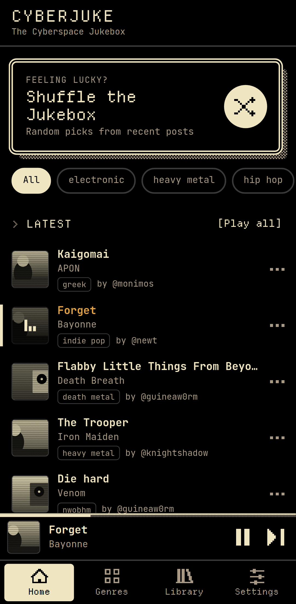
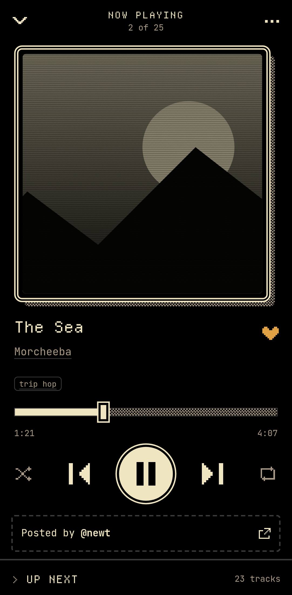
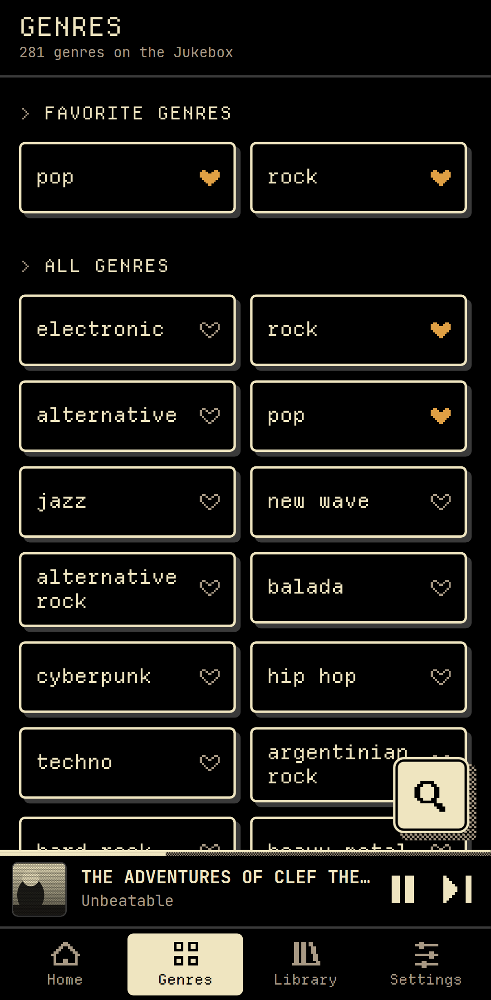

<p align="center"></p>

# CyberJuke

**The [Cyberspace](https://beta.cyberspace.online) Jukebox as a music-streaming app for Android.**

The Cyberspace Jukebox is where people on Cyberspace share the music they love, posted alongside what they write. It's a great way to find music you'd never have come across. CyberJuke turns it into a proper music app. It keeps Cyberspace's retro look and adds a music app's playback: a mini player, a Now Playing screen, an Up Next queue, and playback that continues with the screen off.

> **Unofficial.** CyberJuke is a fan-made app. It is not made, endorsed or supported by Cyberspace or its creator.

<p align="center">
  
  
  
</p>

## Features

- **Latest tracks** posted to the Jukebox, as an endless list.
- **Most saved**: the tracks people saved most on Cyberspace, this month or all time.
- **Search** every track on the Jukebox by title, artist, genre or @poster, with typo tolerance. With an empty query it lists the whole Jukebox, newest first. It works offline once the catalog is cached.
- **Shuffle the Jukebox**: one tap for a random mix from the whole Jukebox.
- **Genres**: browse every genre, heart your favorites to pin them to the top and to Home's filters, and play or shuffle any genre.
- **Artists**: every artist shared on the Jukebox, most-shared first, with hearts for a Favorite artists section. An artist page puts what Cyberspace people shared first, then "More by" the artist and their albums. Tap the artist or genre in Now Playing to jump to their page.
- **Global search** (optional): a separate `[Global]` mode in Search for any song, album, artist or playlist beyond the Jukebox, powered by YouTube Music data. Global tracks can be played, liked and queued, but never show up on Home, Genres, Most saved or Shuffle.
- **Library**: liked tracks and recently played, stored on your phone.
- **Background playback**: the notification, lock screen and headset buttons all work, and the queue keeps going with the screen off.
- **Now Playing**: seek, shuffle, repeat, like, and an Up Next queue you can reorder.
- **"Posted by @user"** opens the original post on Cyberspace, so you can see what the poster wrote and reply.
- **Cyberspace themes**: Dark, Light, C64, VT320, Matrix, Crypt, Bubblegum and Brutalist.
- **NSFW** posts are hidden unless you turn them on.
- **Scroll memory**: every list keeps its place when you switch tabs or go back from a genre or artist, and a back-to-top button appears on long lists.

## Install

1. Download the latest `CyberJuke-<version>.apk` from [Releases](../../releases).
2. Optional: check it against the `.sha256` file published with it: `sha256sum -c CyberJuke-<version>.apk.sha256`.
3. Open the APK on your phone and allow installing from this source when Android asks.

Requires Android 7.0 (API 24) or newer. Android 13+ asks for notification permission the first time you play something. The permission is only used for the playback controls.

CyberJuke is not on the Play Store and won't be (see [Caveats](#caveats)).

## How it works

| Part | What it does |
|---|---|
| **Track list** | Reads the same public post data the Cyberspace website shows on its Jukebox page, through `src/data/firestore.ts`. All data access goes through the `TrackSource` interface in `src/data/source.ts`, so it can be swapped for the [official Cyberspace API](https://api.cyberspace.online) by changing one file. |
| **Playback** | Every Jukebox track is a YouTube link. A native Android player resolves the audio stream with [NewPipeExtractor](https://github.com/TeamNewPipe/NewPipeExtractor) and plays it with Media3/ExoPlayer in a media session. The queue lives in that native service, which is what keeps music going with the screen off. |
| **Global search** | Artist pages ("More by", albums) and Global search use YouTube Music data, read on the phone by NewPipeExtractor through the `JukeMusic` plugin (`src/data/ytmusic.ts` on the web side). Results are cached for 10 minutes. |
| **UI** | Preact and TypeScript in a [Capacitor](https://capacitorjs.com) WebView, with the native player as a Capacitor plugin. |

The app doesn't use an account, track you or include analytics. The only network requests are for the track list, YouTube (to play audio), YouTube Music (only when you use Global search or open an artist page) and artwork.

## Caveats

- **Unofficial data access.** CyberJuke reads Cyberspace's public post data directly, because the official API needs supporter access. This can break if the site changes, and Cyberspace may ask for it to stop. Requests are kept light: 24 posts per page, a 5-minute cache, and no background polling. If the official API becomes available to CyberJuke, it will switch.
- **YouTube.** Playing audio without the official YouTube player goes against YouTube's Terms of Service. It also stops working whenever YouTube changes things, until NewPipeExtractor is updated. This is why CyberJuke is only distributed here and not on the Play Store. Some videos can't be played (removed, private, age-restricted or region-blocked). They are skipped automatically.

## Building

You need Node 22, JDK 21 and the Android SDK (compile SDK 36).

```bash
npm ci
npm run typecheck && npm test   # TypeScript and unit tests
npm run dev                      # browser preview (plays through a YouTube embed)
npm run e2e                      # Playwright tests against live data
npm run sync                     # build the web app and copy it into android/
cd android && ./gradlew assembleDebug
```

CI (`.github/workflows/ci.yml`) runs the web checks and builds the debug APK. It then runs an emulator smoke test (`scripts/ci-smoke.sh`) that checks playback reaches PLAYING and keeps playing in the background.

GitHub's runners are often blocked by YouTube's bot check, so the test also plays a test tone that is bundled only in debug builds. Signed releases are built by the manual `Release` workflow.

## Credits

- **[Cyberspace](https://beta.cyberspace.online)** and its creator **[@genghis_khan](https://beta.cyberspace.online/genghis_khan)**, for the site, its look and the Jukebox.
- **Everyone who posts music** to the Jukebox. Every track in the app is credited to its poster and links to their post.
- **[NewPipeExtractor](https://github.com/TeamNewPipe/NewPipeExtractor)** by Team NewPipe (GPL-3.0), for playback and the YouTube Music data behind Global search and "More by".
- Fonts: [JetBrains Mono](https://github.com/JetBrains/JetBrainsMono) and [Departure Mono](https://departuremono.com), both under the SIL Open Font License.

See [NOTICE.md](NOTICE.md) for all third-party components and their licenses.

## License

[GPL-3.0](LICENSE). The music belongs to its artists, and the posts belong to the people who wrote them.
